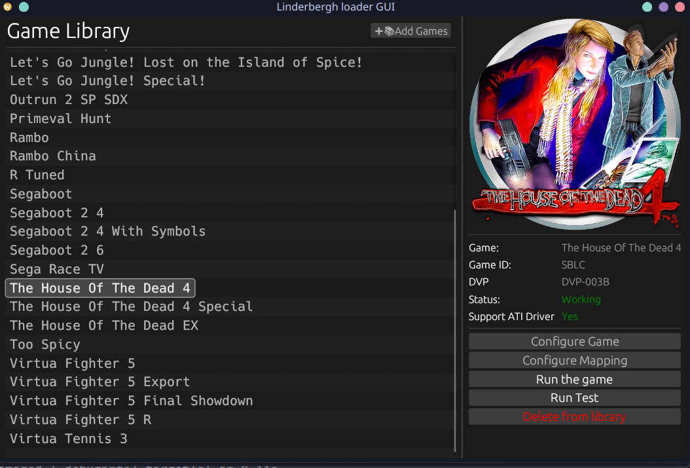
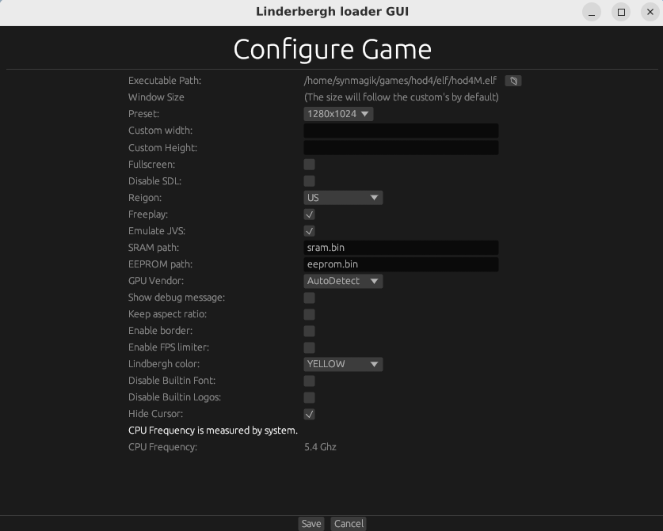
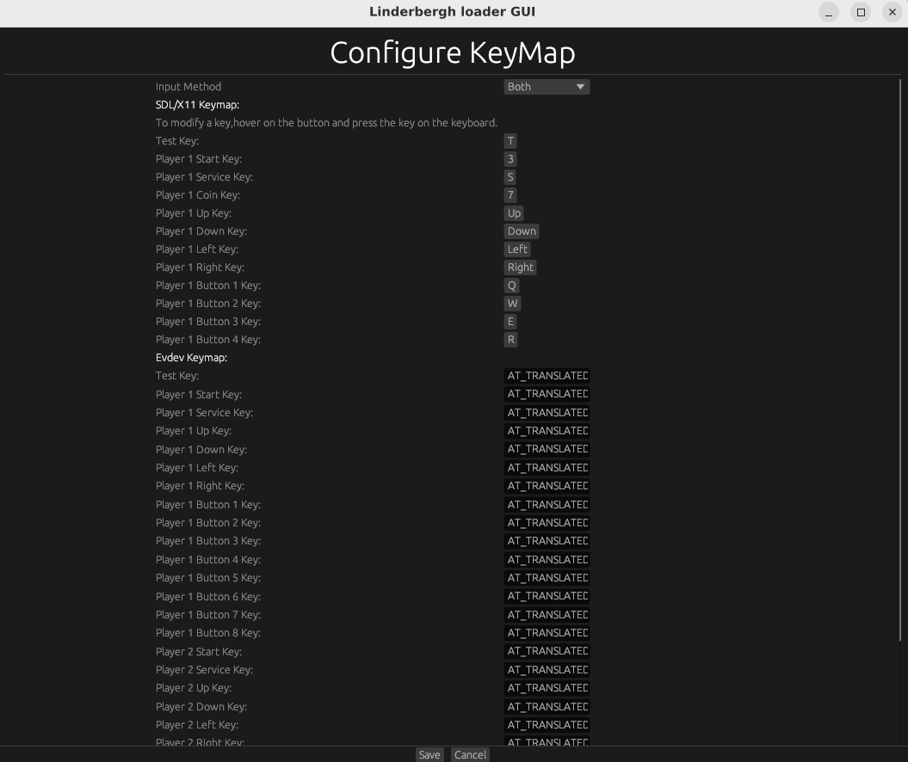

## Lindbergh Loader GUI

This is a GUI for [lindbergh-loader](https://github.com/lindbergh-loader/lindbergh-loader)

**Main Page**



**Game Configuration Page**



**Keymap Configuration Page**



## Pre-Install Requirements

Rust toolchain is needed to compile this project.

for how to install rust toolchain on your computer,see [rustup](https://rustup.rs/)

For graphical dependecies:

- **Desktop Users**: Basically nothing is required


-  **WSL2 Users / Users without desktop environment**: at least one implementation of `xdg-desktop-portal` (for file picker) and X11 with some desktop environment package (such as libadwaita,etc.)

NOTE: I'm not very sure about this.

## Installation

1. [follow the guide on lindbergh-loader](https://github.com/lindbergh-loader/lindbergh-loader) and build the dynamic library.

2. clone or download this project,`cd` into the project's directory and run
```sh
cargo build --release
```
then you can found the executable named `loader-gui` in `./target/release`,move it into anywhere you like.

3. move the `assets` directory into the same-level directory as the executable

4. create a directory named `dynlibs` in the same-level directory as the executable,move everything from `/libs` and `/build` in lindbergh-loader directory.

## Troubleshooting

```
Io error: Broken pipe (os error 32)
Io error: Broken pipe (os error 32)
Io error: Broken pipe (os error 32)
Error: WinitEventLoop(ExitFailure(1))
```
NOTE: So far this only happens on wsl2

**Solution:** idk,just rerun a few more times and it works???

